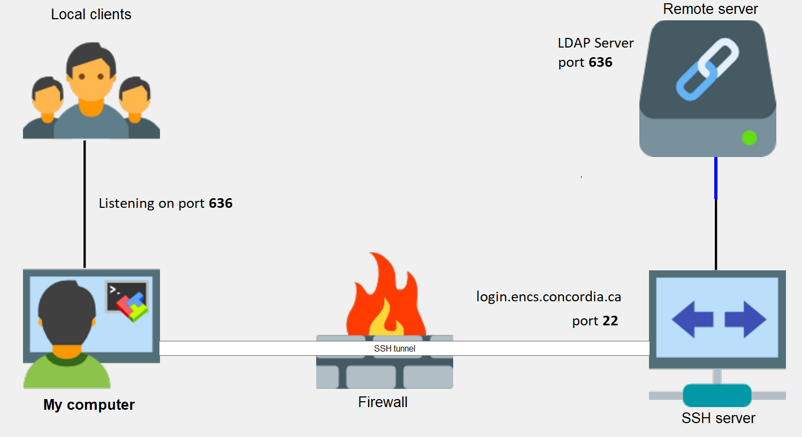

# SOEN490

Infrastructure Information:

	Digital Ocean Ubuntu Server: 165.227.34.184

	Continuous Integration (Jenkins) URL: http://165.227.34.184:8080
		Notifications of builds sent to Slack channel: #jenkinsnotifications

	Github Repository: https://github.com/SteveLocke/SOEN490

## Overview

The app uses the following tools:
- [Python 3+](https://www.python.org/)
- [Django](https://www.djangoproject.com/)
- [Node v8.11.3](https://nodejs.org/en/)
- [React](https://reactjs.org/)

## Getting Started

Docker is used for the deployment of the software in production only.

As a developer you will need to perform the following steps:

### Git Setup
To enforce commit rules we implement some commit hooks that run linting and check that commit messages are properly linked.
To set them up run the following command the first time you setup the repository

```
    sh scrips/setup_hooks.sh
```

### Virtual Environment Setup

- Install virtualenv
```
    pip3 install virtualenv
```

- Create a venv folder where it will contain all the virtual environments
```
    mkdir venv
    cd venv
```

- Create virtual environment
```
    virtualenv CapstoneReservation -p python3
```

- Run virtual environment
```
    source CapstoneReservation/bin/activate
```

- Go inside the the virtual environment directory and clone the project
```
    cd CapstoneReservation
    git clone git@github.com:SteveLocke/CapstoneReservation.git
```

- Go inside the repository and upgrade pip to the latest version
```
    cd CapstoneReservation
    curl https://bootstrap.pypa.io/get-pip.py -o get-pip.py
    python get-pip.py
```

### .env Setup

The application depends on environment variables stored in .env

- Create .env
```
    cp .env.config .env
```

### LDAP Setup



The application is dependent to an internal LDAP server. So, you will have to make a SSH tunnel to get access.

- Create a SSH tunnel
```
    sudo ssh -vvv -N -L 0.0.0.0:636:[LDAPServer]:636 [ENCS_username]@login.encs.concordia.ca
```

where **LDAPServer** can be one of the following server:

- faith.encs.concordia.ca
- charity.encs.concordia.ca
- hope.encs.concordia.ca
- love.encs.concordia.ca


### Django Server Setup

- Install python dependencies
```
    pip3 install -r server/requirements/dev.txt
```

- Go to the root directory of the Django app
```
    cd server
```

-  Create migrations
```
    python3 manage.py makemigrations
```
This will basically look at the DB schema and create scripts to update it if necessary.

- Apply migration changes to the DB
```
    python3 manage.py migrate
```
This will execute the scripts generated previously from **makemigrations** and apply the new schema.

- Create super user
```
    python3 manage.py createsuperuser
```
This will create an user to access to the Django administration interface

- Start Django server
```
    python3 manage.py runserver 0.0.0.0:8000
```

### React Client Setup

- Follow the steps to install yarn on [https://yarnpkg.com/en/docs/install](https://yarnpkg.com/en/docs/install)

- Go to the root directory of the React app
```
    cd client // or cd ../client (dependending on your current directory)
```

- Install node dependencies
```
    yarn install
```
Any **yarn** (or **npm**) command has to be run on the same directory as **package.json**

- Start React app
```
    yarn start
```
The default port of the React app is **3000**

## Repository Structure

```
    server/              : Django server
    └─ apps/             : Django apps
    └─ config/           : Django configs
    │  └─ settings/      : Django settings (dev/prod)
    └─ requirements/     : Python requirements (dev/prod)
    └─ scripts/          : Utility scripts

    client/              : React app
    └─ src/              : Source code
    │  └─ assets         : Assets
    │  |  └─ img/        : media files
    │  |  └─ scss/       : .scss stylesheets (common)
    |  └─ components/    : React components
    |  └─ config/        : Configs
    └─ dist/             : Minified code for production
```

## Useful Commands

- List all Django commands
```
    python3 manage.py --help
```

- Dump DB
```
    python3 scripts/dump_database.py
```

- Populate DB
```
    ./scripts/populate_db.sh
```

- Deactivate virtual environment
```
    deactivate
```

- Run all Django tests
```
    python3 manage.py test apps
```

## Gmail ICS file Import
To import external ICS events sent to a gmail account, that gmail account needs to activate the Gmail API.
One can do so the following Link:
https://developers.google.com/gmail/api/quickstart/python

Store the resulting credentials.json file at
```
server/apps/booking_exporter/GmailImporter
```

The first time the server is run with these credentials a browser window will open with the google authentication flow.

## References

- [http://www.django-rest-framework.org/](http://www.django-rest-framework.org/)
- [http://www.cdrf.co/](http://www.cdrf.co/)
- [https://itnext.io/reacts-component-lifecycle-6c13e09d10ad](https://itnext.io/reacts-component-lifecycle-6c13e09d10ad)
- [https://semantic-ui.com/](https://semantic-ui.com/)
- [https://react.semantic-ui.com/](https://react.semantic-ui.com/)
- [https://github.com/headzoo/react-moment](https://github.com/headzoo/react-moment)
- [https://www.getpostman.com/](https://www.getpostman.com/)
- [https://yarnpkg.com/en/docs/install](https://yarnpkg.com/en/docs/install)
